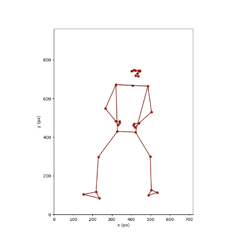
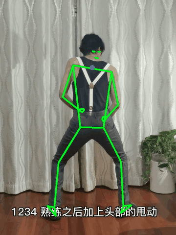
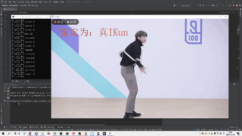
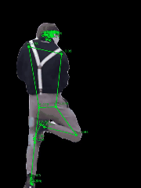
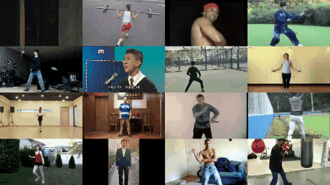

# TelloDroneDetectionPython
麻雀虽小，五脏俱全。这是一个使用Tello无人机视频流、通过RNN模型对人体关键点序列（由mediapipe逐帧推理输出）进行行为预测，进而辨别真假IKUN的综合性项目。项目主要涉及以下知识点：   

- PYQT多线程
- Mediapipe人体关键点检测、人体前景分割
- TensorFlow人体动作/行为识别（RNN）
- OpenCV图像处理、视频读写和画面合成
- Matplotlib可视化（关键点、运动轨迹）

# 环境准备
* mediapipe
* tensorflow (cpu或gpu版本)
* opencv-python
* matplotlib
* pyqt5

# 演示
1. research/trajectory_plot.py：分别使用matplotlib和opencv绘制视频上的人体关键点。首次运行会缓存对应视频每帧检测出的关键点数据至`static_plot_data.pkl`文件，若更换新的视频预测，需要先将该文件删除，以在重新运行时生成并缓存新的`static_plot_data.pkl`文件。   

2. research/animate.py：使用结构十分简单的RNN模型对视频上的任务进行真假IKUN预测。该RNN模型由GRU层、全连接层构成。   

3. research/write_frame_landmarks.py：提取视频中的每帧图像并保存在`analysis_frames/raw_frames`目录下，对每帧图像进行关键点检测，并保存在`analysis_frames/landmark`目录下。最后还生成人体前景分割后的视频片段。   

4. research/patch_video.py：将指定目录（代码中`video_root`）下的多个视频组合成一个1080P的视频。视频总帧数取各视频帧数的最小值M，每个视频只保留前M帧画面。   

5. research/training.ipynb：数据预处理及IKUN识别模型（RNN）的训练。本次试验的正样本数量为55个，通过数据增强后达到152个。数据量很少，但仍达到不错的预测结果。在多组不同序列数目的对照试验中，输入数据的序列数目为45时效果最好。

6. ControlCentre.py：PYQT5应用主程序（飞行控制部分功能更新中）

# 参考
- [2D卡尔曼滤波器](https://stackoverflow.com/questions/13901997/kalman-2d-filter-in-python)   
- [Mediapipe 范例](https://github.com/Kazuhito00/mediapipe-python-sample)
- [计算机视觉小项目 CVprojects](https://github.com/enpeizhao/CVprojects)   

